# Estructura de Desglose del Trabajo (EDT)

## Diagrama general

```mermaid
flowchart TD
  subgraph SEG[Seguridad y Administración de Usuarios]
    U1[Gestión de Usuarios]
    U2[Autenticación / Login]
    U3[Roles y Permisos]
    U4[Empresa]
  end

  subgraph EMP[Gestión de Empleados]
    E1[Empleado - CRM]
    E2[Departamento]
    E3[Puesto]
    E4[Jornada Laboral]
    E5[Banco]
    E6[Historial de Salario]
  end

  subgraph ASI[Gestión de Asistencias]
    A1[Registro Asistencia]
    A2[Entrada / Salida]
    A3[Horas Extra]
    A4[Filtro por Fecha]
  end

  subgraph VAC[Vacaciones y Ausencias]
    V1[Control de Vacaciones]
    V2[Detalle de Vacaciones]
    V3[Incidencias / Ausencias]
    V4[Autorización de Usuario]
  end

  subgraph NOM[Módulo de Nómina]
    N1[Nomina Encabezado]
    N2[Nomina Detalle]
    N3[Cálculo de Liquido]
    N4[Envío de Boleta]
  end

  subgraph MOV[Movimientos y Provisiones]
    M1[Tipo de Movimiento]
    M2[Movimiento de Empleado]
    M3[Provision Prestacion]
  end

  subgraph PAR[Parámetros y Cálculos]
    P1[Parametros Globales]
    P2[Valores IGSS / ISR]
    P3[Bonos y Topes]
    P4[Reglas de Negocio]
  end

  subgraph REP[Reportes y Consultas]
    R1[Reportes de Empleados]
    R2[Historial de Asistencias]
    R3[Vacaciones / Incidencias]
    R4[Reportes de Nómina]
    R5[Auditoría]
  end

  U1 --> E1
  U3 --> U1
  U4 --> U1
  U2 --> U1

  E1 --> A1
  E1 --> V1
  E1 --> N1
  E1 --> M2
  E1 --> R1

  A1 --> R2
  V1 --> R3
  N1 --> R4
  M2 --> R4

  P1 --> N1
  P1 --> M2
  P2 --> N3
  P3 --> V1
  P4 --> N3

  U1 --> R5
  E1 --> R5
  A1 --> R5
  V1 --> R5
  N1 --> R5
  M2 --> R5
```

## Módulos y submódulos detallados

### 1. Seguridad y Administración de Usuarios
- Gestión de usuarios
  - Crear, leer, actualizar, eliminar usuarios (`Usuario`)
  - Control de estado y fecha de eliminación
  - Asociar usuario con empleado y rol
- Autenticación y login
  - Login con `username` y `contrasena`
  - Generación de token / sesión
  - Guardar contraseña segura con hash
- Roles y permisos
  - CRUD de `RolUsuario`
  - Asignación de rol a cada usuario
  - Verificación de permisos en rutas del backend
- Datos corporativos
  - Gestión de `Empresa`
  - NIT y número patronal IGSS
  - Datos de razón social y comercial

### 2. Gestión de Empleados
- Registro de empleado
  - CRUD completo de `Empleado`
  - Validación de DPI, NIT y correo
  - Estado activo / inactivo
- Datos personales y contacto
  - Nombre, apellidos, teléfono, dirección, género, estado civil
  - Correo personal y fotografía
- Organización interna
  - Gestión de `Departamento`
  - Gestión de `Puesto`
  - Gestión de `JornadaLaboral`
- Datos financieros
  - Gestión de `Banco`
  - Cuentas bancarias
  - Historial de `Salario` por empleado
- Relaciones
  - Empleado ↔ Usuario
  - Empleado ↔ Asistencia
  - Empleado ↔ ControlVacacion
  - Empleado ↔ Incidencia
  - Empleado ↔ MovimientoEmpleado
  - Empleado ↔ NominaDetalle

### 3. Gestión de Asistencias
- Registro diario
  - CRUD de `Asistencia`
  - Fecha, hora de entrada, hora de salida
  - Cálculo de horas trabajadas
- Horas extra
  - Registro de `HorasExtra`
  - Cálculos por jornada
- Control de estado
  - `Activo` y `FechaEliminacion`
  - Filtrado por empleado y rango de fechas
- Reportes
  - Historial de asistencias por empleado
  - Reportes de horarios y ausencias

### 4. Vacaciones y Ausencias
- Control de vacaciones
  - CRUD de `ControlVacacion`
  - Días ganados y días gozados
  - Cálculo de saldo de vacaciones
- Detalle de vacaciones
  - CRUD de `DetalleControlVacacion`
  - Relación con incidencias y días descontados
- Incidencias
  - CRUD de `Incidencia`
  - Registro de ausencias, permisos y licencias
  - Configurar con o sin goce de sueldo
  - Autorización de usuario con permiso

### 5. Nómina
- Encabezado de nómina
  - CRUD de `NominaEncabezado`
  - Mes, año, quincena, estado
  - Usuario responsable / gerente
- Detalle de nómina
  - CRUD de `NominaDetalle`
  - Dias laborados, sueldo base, bonificaciones, descuentos
  - Cálculo de `LiquidoRecibir`
- Envío de boletas
  - `RegistroEnvioBoleta`
  - Fecha de envío, éxito, usuario que envía
- Integración con empleados
  - Relación de cada detalle con empleado
  - Generación de planilla por periodo

### 6. Movimientos y Provisiones
- Tipos de movimiento
  - CRUD de `TipoMovimiento`
  - Clasificación, afectación a IGSS/ISR, fijo o variable
- Movimientos de empleado
  - CRUD de `MovimientoEmpleado`
  - Monto, mes y año de aplicación
  - Usuario que registra el movimiento
- Provisiones legales
  - CRUD de `ProvisionPrestacion`
  - Bono 14, aguinaldo, indemnización, provisión de vacaciones
  - Historial por mes y año

### 7. Parámetros y Cálculos
- Parámetros globales
  - CRUD de `ParametroGlobal`
  - Valores base para cálculos legales y financieros
- Valores fiscales
  - IGSS, ISR, topes, bonificaciones
  - Ajustes según normativa de Guatemala
- Reglas de cálculo
  - Fórmulas de nómina
  - Cálculo de descuentos y salario líquido
  - Aplicación de provisiones y cargas sociales

### 8. Reportes y Consultas
- Reportes operativos
  - Listado de empleados activos
  - Historial de asistencias y vacaciones
  - Control de incidencias
- Reportes de nómina
  - Nóminas generadas por mes/quincena
  - Totales de descuentos y pagos
  - Provisiones acumuladas
- Auditoría
  - Registro de cambios en datos maestros
  - Acciones de usuario sobre nómina y autorizaciones
