# ESTRUCTURA DE DESGLOSE DEL TRABAJO (EDT) - SISTEMA DE PAGO DE NÓMINA
## Proyecto: Sistema Integral de Gestión de Recursos Humanos y Finanzas
## Fecha: Abril 2026
## Versión: 2.0 - Actualizado con funcionalidades extendidas

---

## 📊 **RESUMEN EJECUTIVO**

### **Estado General del Proyecto:**
- ✅ **Fase 1 (Datos Maestros RRHH)**: 100% Completada
- ✅ **Fase 2 (Nómina Básica)**: 100% Completada
- 🔄 **Fase 3 (Estados de Nómina)**: 80% Completada (Backend listo, Frontend pendiente)
- 🟡 **Fase 4 (Ventas y Clientes)**: 0% Implementada
- 🟡 **Fase 5 (Finanzas y Capital)**: 0% Implementada
- 🟡 **Fase 6 (Estadísticas y Eficiencia)**: 0% Implementada
- 🟡 **Fase 7 (Reportes Avanzados)**: 0% Implementada

### **Tecnologías Utilizadas:**
- **Backend**: NestJS 11+, Prisma ORM, SQL Server
- **Frontend**: Angular 17+, PrimeNG 21, Signals
- **Autenticación**: JWT con Guards
- **Base de Datos**: SQL Server con Soft Delete

---

## 🎯 **DIAGRAMA GENERAL ACTUALIZADO**

```mermaid
flowchart TD
    subgraph SEG[FASE 1: Seguridad y Usuarios ✅]
        U1[Gestión de Usuarios]
        U2[Autenticación JWT]
        U3[Roles y Permisos]
        U4[Empresa]
    end

    subgraph RRHH[FASE 1: Datos Maestros RRHH ✅]
        E1[Empleado - CRM]
        E2[Departamento]
        E3[Puesto]
        E4[Jornada Laboral]
        E5[Banco]
        E6[Historial Salario]
    end

    subgraph NOM[FASE 2: Nómina Básica ✅]
        N1[Encabezado Nómina]
        N2[Detalle Nómina]
        N3[Cálculos Guatemala]
        N4[Envío Boletas]
    end

    subgraph EST[FASE 3: Estados de Nómina 🔄]
        ES1[Estados de Nómina]
        ES2[Flujo de Aprobación]
        ES3[Historial de Cambios]
        ES4[Notificaciones]
    end

    subgraph VEN[FASE 4: Ventas y Clientes 🟡]
        V1[Gestión de Clientes]
        V2[Productos/Servicios]
        V3[Facturación]
        V4[Estados de Pago]
    end

    subgraph FIN[FASE 5: Finanzas y Capital 🟡]
        F1[Cuentas Bancarias]
        F2[Movimientos Financieros]
        F3[Control de Capital]
        F4[Balance General]
    end

    subgraph KPI[FASE 6: Estadísticas y Eficiencia 🟡]
        K1[Indicadores de Eficiencia]
        K2[Estadísticas Mensuales]
        K3[Presupuestos Anuales]
        K4[Dashboard Ejecutivo]
    end

    subgraph REP[FASE 7: Reportes Avanzados 🟡]
        R1[Reportes RRHH]
        R2[Reportes Financieros]
        R3[Análisis de Tendencias]
        R4[Exportación de Datos]
    end

    SEG --> RRHH
    RRHH --> NOM
    NOM --> EST
    EST --> VEN
    VEN --> FIN
    FIN --> KPI
    KPI --> REP
```



---

## 📋 **DETALLE POR FASES**

### **FASE 1: SEGURIDAD Y USUARIOS** ✅ COMPLETADA
**Estado**: 100% Implementado
**Módulos Backend**: ✅ `login/`, `usuario/`, `rol/`
**Módulos Frontend**: ✅ `login/`, `usuario/`, `seguridad/`

#### **1.1 Gestión de Usuarios**
- ✅ CRUD completo de `Usuario`
- ✅ Asociación con Empleado y Rol
- ✅ Control de estado activo/inactivo
- ✅ Soft delete con `FechaEliminacion`

#### **1.2 Autenticación y Login**
- ✅ Login con JWT tokens
- ✅ Guards de autenticación en todas las rutas
- ✅ Hash seguro de contraseñas
- ✅ Interceptor de tokens en frontend

#### **1.3 Roles y Permisos**
- ✅ CRUD de `RolUsuario`
- ✅ Asignación de roles por usuario
- ✅ Verificación de permisos en backend
- ✅ Control de acceso por roles

#### **1.4 Datos Corporativos**
- ✅ Gestión de `Empresa`
- ✅ NIT y número patronal IGSS
- ✅ Razón social y nombre comercial
- ✅ **NUEVO**: Campos de capital inicial/actual

---

### **FASE 1: GESTIÓN DE EMPLEADOS** ✅ COMPLETADA
**Estado**: 100% Implementado
**Módulos Backend**: ✅ `empleado/`, `departamento/`, `puesto/`, `jornada-laboral/`, `banco/`
**Módulos Frontend**: ✅ `empleado/`, `departamento/`, `puesto/`, `jornada-laboral/`, `banco/`

#### **1.1 Registro de Empleado**
- ✅ CRUD completo de `Empleado`
- ✅ Validación DPI, NIT, correo único
- ✅ Estado activo/inactivo con soft delete

#### **1.2 Datos Personales y Contacto**
- ✅ Nombre, apellidos, teléfono, dirección
- ✅ Género, estado civil, correo, fotografía
- ✅ Fecha de ingreso y datos completos

#### **1.3 Organización Interna**
- ✅ Gestión de `Departamento`
- ✅ Gestión de `Puesto` con relación departamento
- ✅ Gestión de `JornadaLaboral` (horas diarias/semanales)

#### **1.4 Datos Financieros**
- ✅ Gestión de `Banco`
- ✅ Cuentas bancarias por empleado
- ✅ Historial de `Salario` con fechas de vigencia

---

### **FASE 2: NÓMINA BÁSICA** ✅ COMPLETADA
**Estado**: 100% Implementado
**Módulos Backend**: ✅ `nomina/`, `parametro-global/`
**Módulos Frontend**: ✅ `nomina/`, `parametro-global/`

#### **2.1 Encabezado de Nómina**
- ✅ CRUD de `NominaEncabezado`
- ✅ Mes, año, quincena, fecha generación
- ✅ Usuario gerente responsable

#### **2.2 Detalle de Nómina**
- ✅ CRUD de `NominaDetalle`
- ✅ Días laborados, sueldo base, bonificaciones
- ✅ Descuentos IGSS, ISR, IRTRA, INTECAP
- ✅ Cálculo de líquido a recibir

#### **2.3 Cálculos Guatemala**
- ✅ IGSS 3.67% empleado
- ✅ ISR progresivo (6 tramos)
- ✅ Bono 14 (8.33% mensual)
- ✅ Aguinaldo (8.33% mensual)
- ✅ Bono productividad parametrizable

#### **2.4 Envío de Boletas**
- ✅ `RegistroEnvioBoleta`
- ✅ Fecha envío, estado éxito
- ✅ Usuario que realiza envío

---

### **FASE 3: ESTADOS DE NÓMINA** 🔄 EN DESARROLLO
**Estado**: 80% Backend Completo, 0% Frontend
**Módulos Backend**: ✅ Esquema listo, Controlador pendiente
**Módulos Frontend**: ❌ Pendiente implementación

#### **3.1 Estados de Nómina** ✅
- ✅ Tabla `EstadoNomina` con flujo definido
- ✅ Estados: BORRADOR → PENDIENTE → APROBADO → PAGADO
- ✅ Campo `RequiereAprobacion` por estado

#### **3.2 Historial de Cambios** ✅
- ✅ Tabla `HistorialEstadoNomina`
- ✅ Auditoría completa de cambios
- ✅ Usuario, fecha y comentarios

#### **3.3 Flujo de Aprobación** ❌
- ❌ Lógica de cambio de estados
- ❌ Validaciones por rol de usuario
- ❌ Notificaciones de cambios

#### **3.4 Notificaciones** ❌
- ❌ Alertas de cambios de estado
- ❌ Notificaciones por email
- ❌ Dashboard de aprobaciones pendientes

---

### **FASE 4: VENTAS Y CLIENTES** 🟡 PENDIENTE
**Estado**: 0% Implementado
**Módulos Backend**: ❌ Pendiente
**Módulos Frontend**: ❌ Pendiente

#### **4.1 Gestión de Clientes**
- ❌ Tabla `Cliente` (individual/empresa)
- ❌ CRUD completo de clientes
- ❌ Validación NIT/DPI únicos

#### **4.2 Productos y Servicios**
- ❌ Tabla `ProductoServicio`
- ❌ Catálogo de productos/servicios
- ❌ Precios y costos parametrizables

#### **4.3 Facturación**
- ❌ Tabla `Venta` y `DetalleVenta`
- ❌ Generación de facturas
- ❌ Cálculos de subtotal, impuestos, total

#### **4.4 Estados de Pago**
- ❌ Estados: PENDIENTE, PAGADO, CANCELADO
- ❌ Fechas de vencimiento
- ❌ Control de morosidad

---

### **FASE 5: FINANZAS Y CAPITAL** 🟡 PENDIENTE
**Estado**: 0% Implementado
**Módulos Backend**: ❌ Pendiente
**Módulos Frontend**: ❌ Pendiente

#### **5.1 Cuentas Bancarias**
- ❌ Tabla `CuentaBancariaEmpresa`
- ❌ Múltiples cuentas por banco
- ❌ Saldos actualizados automáticamente

#### **5.2 Movimientos Financieros**
- ❌ Tabla `MovimientoFinanciero`
- ❌ Ingresos por ventas, egresos por nómina
- ❌ Categorización de movimientos

#### **5.3 Control de Capital**
- ❌ Actualización automática de capital
- ❌ Campo `CapitalActual` en Empresa
- ❌ Alertas de niveles críticos

#### **5.4 Balance General**
- ❌ Vista `vw_BalanceMensual`
- ❌ Reportes de ingresos/egresos
- ❌ Análisis de flujo de caja

---

### **FASE 6: ESTADÍSTICAS Y EFICIENCIA** 🟡 PENDIENTE
**Estado**: 0% Implementado
**Módulos Backend**: ❌ Pendiente
**Módulos Frontend**: ❌ Pendiente

#### **6.1 Indicadores de Eficiencia**
- ❌ Tabla `IndicadorEficiencia`
- ❌ KPIs predefinidos (ventas, productividad, etc.)
- ❌ Metas mínimas/máximas configurables

#### **6.2 Estadísticas Mensuales**
- ❌ Tabla `EstadisticaMensual`
- ❌ Cálculo automático mensual
- ❌ Almacenamiento histórico

#### **6.3 Presupuestos Anuales**
- ❌ Tabla `PresupuestoAnual`
- ❌ Presupuestos por año
- ❌ Comparación real vs presupuesto

#### **6.4 Dashboard Ejecutivo**
- ❌ Vista `vw_IndicadoresEficiencia`
- ❌ Gráficos y métricas visuales
- ❌ Alertas de desviaciones

---

### **FASE 7: REPORTES AVANZADOS** 🟡 PENDIENTE
**Estado**: 0% Implementado
**Módulos Backend**: ❌ Pendiente
**Módulos Frontend**: ❌ Pendiente

#### **7.1 Reportes RRHH**
- ❌ Reportes de empleados activos
- ❌ Estadísticas de asistencia/vacaciones
- ❌ Análisis de rotación de personal

#### **7.2 Reportes Financieros**
- ❌ Estados financieros mensuales
- ❌ Análisis de rentabilidad
- ❌ Proyecciones financieras

#### **7.3 Análisis de Tendencias**
- ❌ Gráficos de evolución mensual
- ❌ Predicciones basadas en histórico
- ❌ Identificación de patrones

#### **7.4 Exportación de Datos**
- ❌ Exportación a Excel/PDF
- ❌ Filtros avanzados
- ❌ Programación de reportes

---

## 🔧 **ESTADO DE IMPLEMENTACIÓN DETALLADO**

### **Backend - Módulos Completados:**
✅ `login/` - Autenticación JWT completa
✅ `usuario/` - Gestión de usuarios
✅ `rol/` - Roles y permisos
✅ `empleado/` - CRUD empleados
✅ `departamento/` - Departamentos
✅ `puesto/` - Puestos de trabajo
✅ `jornada-laboral/` - Jornadas laborales
✅ `banco/` - Bancos
✅ `nomina/` - Sistema de nómina
✅ `parametro-global/` - Parámetros del sistema
✅ `asistencia/` - Control de asistencias
✅ `control-vacacion/` - Vacaciones
✅ `detalle-control-vacacion/` - Detalle de vacaciones
✅ `incidencia/` - Incidencias/ausencias

### **Backend - Módulos Pendientes:**
❌ Estados de nómina (lógica de flujo)
❌ Ventas y clientes
❌ Finanzas y capital
❌ Estadísticas y eficiencia
❌ Reportes avanzados

### **Frontend - Componentes Completados:**
✅ `login/` - Autenticación
✅ `usuario/` - Gestión usuarios
✅ `seguridad/` - Seguridad del sistema
✅ `empleado/` - CRUD empleados
✅ `departamento/` - Departamentos
✅ `puesto/` - Puestos
✅ `jornada-laboral/` - Jornadas
✅ `banco/` - Bancos
✅ `nomina/` - Generador de nómina
✅ `parametro-global/` - Parámetros
✅ `asistencia/` - Asistencias
✅ `vacacion/` - Vacaciones

### **Frontend - Componentes Pendientes:**
❌ Estados de nómina (aprobaciones)
❌ Ventas y facturación
❌ Finanzas y capital
❌ Dashboard de estadísticas
❌ Reportes avanzados

---

## 📈 **PRIORIDADES DE DESARROLLO**

### **Próximas Fases (Orden Sugerido):**

1. **🔥 ALTA**: Fase 3 - Estados de Nómina (Completar lógica de flujo)
2. **🔥 ALTA**: Fase 4 - Ventas y Clientes (Funcionalidad crítica)
3. **🟡 MEDIA**: Fase 5 - Finanzas y Capital (Complementario a ventas)
4. **🟡 MEDIA**: Fase 6 - Estadísticas (Dashboard ejecutivo)
5. **🟢 BAJA**: Fase 7 - Reportes Avanzados (Mejora continua)

### **Tiempo Estimado por Fase:**
- Fase 3: 2-3 semanas (completar lógica pendiente)
- Fase 4: 4-5 semanas (ventas completas)
- Fase 5: 3-4 semanas (finanzas)
- Fase 6: 2-3 semanas (estadísticas)
- Fase 7: 3-4 semanas (reportes)

---

## 🎯 **CONCLUSIONES**

### **Lo que tenemos:**
✅ Sistema sólido de RRHH con nómina básica
✅ Autenticación y seguridad implementada
✅ Base de datos extendida con nuevas funcionalidades
✅ Arquitectura modular y escalable

### **Lo que necesitamos implementar:**
🔄 Completar flujo de estados de nómina
🆕 Sistema completo de ventas y facturación
🆕 Control financiero y de capital
🆕 Dashboard de estadísticas y eficiencia
🆕 Reportes avanzados y análisis

### **Recomendación:**
Continuar con **Fase 3** (estados de nómina) para completar la funcionalidad crítica de nómina, luego proceder con **Fase 4** (ventas) que es fundamental para el control financiero de la empresa.

---

*EDT actualizado al 19 de Abril 2026 - Versión 2.0*
    P1[Parametros Globales]
    P2[Valores IGSS / ISR]
    P3[Bonos y Topes]
    P4[Reglas de Negocio]
  end

  subgraph REP[Reportes y Consultas]
    R1[Reportes de Empleados]
    R2[Historial de Asistencias]
    R3[Vacaciones / Incidencias]
    R4[Reportes de Nómina]
    R5[Auditoría]
  end

  U1 --> E1
  U3 --> U1
  U4 --> U1
  U2 --> U1

  E1 --> A1
  E1 --> V1
  E1 --> N1
  E1 --> M2
  E1 --> R1

  A1 --> R2
  V1 --> R3
  N1 --> R4
  M2 --> R4

  P1 --> N1
  P1 --> M2
  P2 --> N3
  P3 --> V1
  P4 --> N3

  U1 --> R5
  E1 --> R5
  A1 --> R5
  V1 --> R5
  N1 --> R5
  M2 --> R5
```

## Módulos y submódulos detallados

### 1. Seguridad y Administración de Usuarios
- Gestión de usuarios
  - Crear, leer, actualizar, eliminar usuarios (`Usuario`)
  - Control de estado y fecha de eliminación
  - Asociar usuario con empleado y rol
- Autenticación y login
  - Login con `username` y `contrasena`
  - Generación de token / sesión
  - Guardar contraseña segura con hash
- Roles y permisos
  - CRUD de `RolUsuario`
  - Asignación de rol a cada usuario
  - Verificación de permisos en rutas del backend
- Datos corporativos
  - Gestión de `Empresa`
  - NIT y número patronal IGSS
  - Datos de razón social y comercial

### 2. Gestión de Empleados
- Registro de empleado
  - CRUD completo de `Empleado`
  - Validación de DPI, NIT y correo
  - Estado activo / inactivo
- Datos personales y contacto
  - Nombre, apellidos, teléfono, dirección, género, estado civil
  - Correo personal y fotografía
- Organización interna
  - Gestión de `Departamento`
  - Gestión de `Puesto`
  - Gestión de `JornadaLaboral`
- Datos financieros
  - Gestión de `Banco`
  - Cuentas bancarias
  - Historial de `Salario` por empleado
- Relaciones
  - Empleado ↔ Usuario
  - Empleado ↔ Asistencia
  - Empleado ↔ ControlVacacion
  - Empleado ↔ Incidencia
  - Empleado ↔ MovimientoEmpleado
  - Empleado ↔ NominaDetalle

### 3. Gestión de Asistencias
- Registro diario
  - CRUD de `Asistencia`
  - Fecha, hora de entrada, hora de salida
  - Cálculo de horas trabajadas
- Horas extra
  - Registro de `HorasExtra`
  - Cálculos por jornada
- Control de estado
  - `Activo` y `FechaEliminacion`
  - Filtrado por empleado y rango de fechas
- Reportes
  - Historial de asistencias por empleado
  - Reportes de horarios y ausencias

### 4. Vacaciones y Ausencias
- Control de vacaciones
  - CRUD de `ControlVacacion`
  - Días ganados y días gozados
  - Cálculo de saldo de vacaciones
- Detalle de vacaciones
  - CRUD de `DetalleControlVacacion`
  - Relación con incidencias y días descontados
- Incidencias
  - CRUD de `Incidencia`
  - Registro de ausencias, permisos y licencias
  - Configurar con o sin goce de sueldo
  - Autorización de usuario con permiso

### 5. Nómina
- Encabezado de nómina
  - CRUD de `NominaEncabezado`
  - Mes, año, quincena, estado
  - Usuario responsable / gerente
- Detalle de nómina
  - CRUD de `NominaDetalle`
  - Dias laborados, sueldo base, bonificaciones, descuentos
  - Cálculo de `LiquidoRecibir`
- Envío de boletas
  - `RegistroEnvioBoleta`
  - Fecha de envío, éxito, usuario que envía
- Integración con empleados
  - Relación de cada detalle con empleado
  - Generación de planilla por periodo

### 6. Movimientos y Provisiones
- Tipos de movimiento
  - CRUD de `TipoMovimiento`
  - Clasificación, afectación a IGSS/ISR, fijo o variable
- Movimientos de empleado
  - CRUD de `MovimientoEmpleado`
  - Monto, mes y año de aplicación
  - Usuario que registra el movimiento
- Provisiones legales
  - CRUD de `ProvisionPrestacion`
  - Bono 14, aguinaldo, indemnización, provisión de vacaciones
  - Historial por mes y año

### 7. Parámetros y Cálculos
- Parámetros globales
  - CRUD de `ParametroGlobal`
  - Valores base para cálculos legales y financieros
- Valores fiscales
  - IGSS, ISR, topes, bonificaciones
  - Ajustes según normativa de Guatemala
- Reglas de cálculo
  - Fórmulas de nómina
  - Cálculo de descuentos y salario líquido
  - Aplicación de provisiones y cargas sociales

### 8. Reportes y Consultas
- Reportes operativos
  - Listado de empleados activos
  - Historial de asistencias y vacaciones
  - Control de incidencias
- Reportes de nómina
  - Nóminas generadas por mes/quincena
  - Totales de descuentos y pagos
  - Provisiones acumuladas
- Auditoría
  - Registro de cambios en datos maestros
  - Acciones de usuario sobre nómina y autorizaciones
